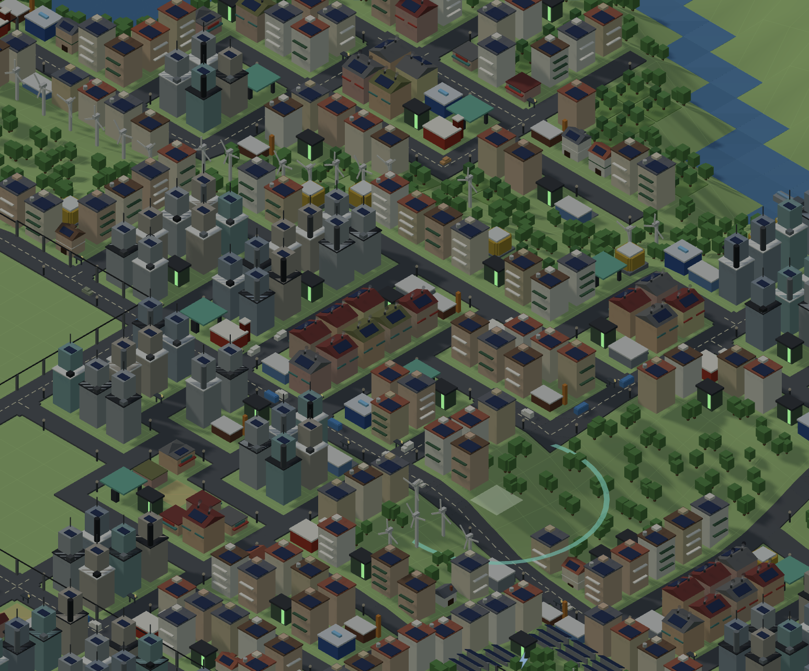

# ⚡ Voltopia

A modern, streamlined city builder for the browser. Your city runs entirely
on renewable energy and every vehicle is electric — balancing fluctuating
generation against consumption is the core of the game.

Built with a low-poly 3D look in the spirit of minimalist city builders:
few key metrics, feedback directly in the world, organic growth, minimal
micromanagement.

## Screenshots

<p align="center">
  
</p>

## Gameplay

- **Build roads** by dragging; intersections, curves and dead ends connect
  automatically.
- **Paint zones** — residential, commercial, retail. Buildings appear next
  to roads when there is demand, and densify through three levels.
- **Power the city** with solar farms, wind turbines, battery storage and a
  dispatchable (but expensive) biogas plant. Plants only supply what your
  **power lines** (⚡, key L) connect to them — lines run over roads and
  across water, and every connected line tile reaches three tiles around it.
- **Water**: every map has a seeded river and lake. Bridge the river with
  the road tool, build run-of-river plants on it (output follows rain
  and drought) and pumped storage on the lake shore — a big, slow store
  that fills after your batteries.
- **Seasons**: a 20-day year. Summer means long days and PV surplus, but
  also an electric cooling load that peaks in the late afternoon as PV
  fades; winter means short days, weak sun, more cloud and wind, snow on
  the ground and a heating load that peaks on cold nights. Snowpack
  melts into the river in spring. A one-off building insulation upgrade
  halves both the heating and the cooling load.
- **Watch the balance**: surplus charges batteries, then is curtailed.
  Deficits discharge storage, dispatch biogas — and beyond that, buildings
  flicker and go dark, happiness drops, growth stops.
- **Day/night and weather** drive everything: PV follows the sun and cloud
  cover, wind turbines follow the wind, homes and shops follow their daily
  load profiles.
- **E-mobility**: the EV fleet grows with your city. Home charging peaks in
  the evening; charging hubs shift the load into the PV-friendly daytime,
  and the smart-charging upgrade follows the generation surplus
  automatically. Cars commute on the cheapest route; avenues carry more
  traffic faster, and the traffic overlay shows where it jams. A logistics
  depot sends electric vans to the shops; retail without deliveries stops
  growing. Bus stops and a bus depot put electric buses on the roads;
  commuters covered at both ends leave the car at home.
- **Economy**: construction costs, taxes (with a slider), upkeep, biogas
  fuel costs.
- **Overlays** show supply status (connected, undersupplied, not connected
  to the grid), growth demand, and fire/police coverage; the energy panel
  tracks generation per source, consumption, state of charge, curtailment
  and the last in-game day.

Beyond the core loop: **multi-day weather fronts** (including genuine
Dunkelflaute spells), **rooftop PV** that grows with density, a limited
**grid interconnector** (expensive imports, modest export revenue),
**abandonment** of chronically unpowered buildings, **fire and police
stations** with powered coverage rings, a services overlay,
**delivery traffic** with a depot, vans and a well-stocked goal,
**public transit** with bus stops, a depot, a coverage overlay and a
modal-shift goal, and city goals (including a safe-city goal and a
free-flow traffic goal), an **interactive tutorial**, warning icons in
the world, touch gestures, tool hotkeys, synthesized sound effects, and
a settings panel with save slots and JSON save export/import. UI in
**English and German**.

The game saves automatically (IndexedDB) and is playable offline as a PWA.

## Playing with an AI agent

The game exposes its actions as [WebMCP](https://webmachinelearning.github.io/webmcp/)
tools (`document.modelContext`) and, in every browser, on
`window.voltopia` — build, zone, inspect, read the map, fast-forward. See
[docs/agent-tools.md](docs/agent-tools.md).

## Controls

| Input                   | Action                                           |
| ----------------------- | ------------------------------------------------ |
| Left mouse              | Use the selected tool (drag to draw roads/zones) |
| Right/middle mouse drag | Pan the camera                                   |
| Mouse wheel             | Zoom                                             |
| `Q` / `E`               | Rotate the view in 90° steps                     |

## Development

Requirements: Node.js ≥ 22, [pnpm](https://pnpm.io).

```bash
pnpm install
pnpm dev        # start the dev server
pnpm test       # simulation unit tests (Vitest)
pnpm coverage   # tests with coverage (target: >90% for src/sim)
pnpm e2e        # end-to-end tests (Playwright)
pnpm lint       # oxlint
pnpm format     # oxfmt (format:check only verifies)
pnpm audit:prod # fail on high/critical advisories in shipped deps
pnpm build      # production build
```

### Architecture

- `src/sim/` — pure simulation logic, runs in a Web Worker. Deterministic
  (seeded RNG, including weather), fixed tick (4/s), typed-array tile
  layers. No DOM or three.js dependencies.
- `src/render/` — three.js rendering: orthographic isometric camera,
  instanced meshes for roads, buildings, plants and vehicles, day/night
  lighting.
- `src/ui/` — React 19 HUD and tools.
- `src/shared/` — types, the worker message protocol, and the central
  balancing configuration (`constants.ts` — no magic numbers in sim code).
- `src/storage/` — save-game persistence behind a small interface
  (IndexedDB by default).
- `src/agent/` — machine-facing tools (WebMCP + `window.voltopia`) over
  the bridge; DOM-free except for the registration module.

The worker sends only tile diffs and global stats to the main thread,
never the full state. See `docs/idea.md` for the design document and
`docs/plan.md` for the implementation plan.

## Native app (macOS / iPadOS)

The same build runs as a Tauri app. Requirements: Rust (rustup, stable)
and Xcode command line tools; for iPad also Xcode and
`rustup target add aarch64-apple-ios aarch64-apple-ios-sim`.

```bash
pnpm tauri dev                     # macOS window with hot reload
pnpm tauri build                   # .app + .dmg in src-tauri/target/release/bundle/
pnpm tauri ios dev 'iPad Pro 13-inch (M4)'   # iPad simulator
pnpm tauri ios build --export-method debugging  # install on your own iPad
```

Builds are ad-hoc signed, not notarized: on first launch macOS blocks the app; allow it under System Settings → Privacy & Security → Open Anyway, or run `xattr -dr com.apple.quarantine /Applications/Voltopia.app`. Save games live in the app's own storage; use Settings → Export /
Import to move a city between browser and app.

## License

[MIT](LICENSE)
